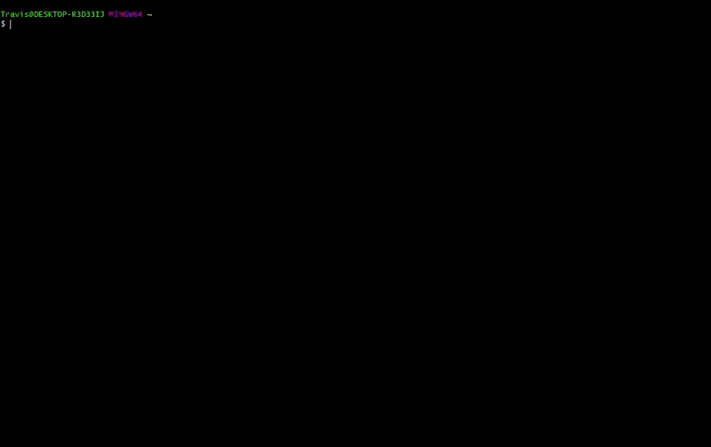

<style type="text/css">
body{ /* Normal  */
      font-size: 14pt;
  }
pre {
  font-size: 12pt
}
</style>

# Warming Up

In this module, we will:

* cover basic materials needed
* familiarize ourselves with remote computing
* prepare for later modules

## Building Blocks

<br>
<br>
<br>

<br>
<br>
<br>


## Example Files Exercise:

1. Download the zipped archive from the slack channel
2. Locate, move (if desired), and unzip it
3. Remember how to access these files

<br>
<br>
<br>
<br>
<br>
<br>

## Local vs remote exercise:

1. Become familiar with the different appearance of the local shell
2. Briefly explore your local files
3. Log in to the aws instance with `ssh <username>@bfx-workshop01.med.umich.edu`
4. Become familiar with appearance of the remote shell
5. Briefly explore remote files
6. Use `exit` to log off, return to local shell

<br>
<br>
<br>

```
# Familiarize with local shell appearance
# Briefly explore your local files
ls -l
# Log in to the aws instance via ssh
ssh <username>@bfx-workshop01.med.umich.edu
# Familiarize yourself with differences between local and remote shell
# Briefly explore remote files
ls -l
# Log off, return to local shell
exit
```


<br>
<br>
<br>

<details>
<summary>Click here for demonstration of local (git-bash on Windows) vs remote (AWS)</summary>



</details>

<br>
<br>
<br>

## Orientation exercise

Note: We will provide additional time during this exercise to ensure that everyone is prepared to move forward.

Orientation exercise:

1. Log in (or confirm logged in) to aws instance
2. Ensure in home directory with `cd`
4. Use `ls` to view references
5. Use `ls` to view input fastq files
6. Use `mkdir` to create a folder for our analysis

<br>
<br>
<br>

```
# Log in to aws remote
ssh <username>@bfx-workshop01.med.umich.edu
# Ensure we are in home directory
cd
# View our references
ls ~/data/refs
# View our input fastq files
ls ~/data/reads
# Create a folder for our analysis
mkdir ~/analysis
```


<br>
<br>
<br>
<br>
<br>
<br>

<br>
<br>
<br>
<br>
<br>
<br>
<br>
<br>
<br>
<br>
<br>
<br>
<br>
<br>
<br>
