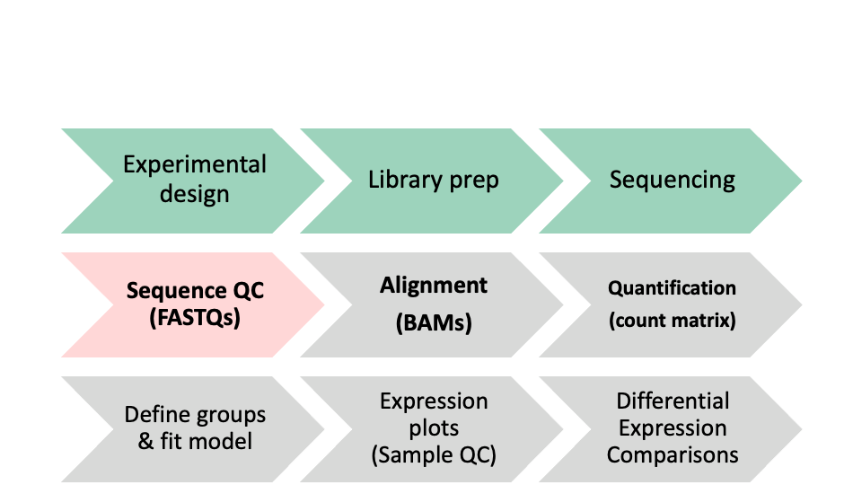

# More QC - Cutadapt and MultiQC

In this module we will learn:

* about the cutadapt software and its uses
* how to use the cutadapt tool for trimming adapters
* how to trim all of our samples in a for-loop
* about the MultiQC tool and its capabilities
* how to run multiQC on a remote system

# Differential Expression Workflow

As a reminder, our overall differential expression workflow is shown below. In this lesson, we will go over the highlighed portion of the workflow.


<br>
<br>
<br>
<br>

# Cutadapt

[Cutadapt](https://cutadapt.readthedocs.io/en/stable/) is a very widely used read trimming and fastq processing software, cited several thousands of times. It's written in python, and is user-friendly and reasonably fast.

It is used for removing adapter sequences, primers, and poly-A tails, for trimming based on quality thresholds, for filtering reads based on characteristics, etc.

It can operate on both FASTA and FASTQ file formats, and it supports compressed or raw inputs and outputs.

Notably, cutadapt's error-tolerant adapter trimming likely contributed greatly to its early popularity. We will use it to trim the adapters from our reads. Similar to earlier, we'll discuss the details of cutadapt's functionality and input/output files, before proceeding to an exercise where we can try running the software ourselves.


## Cutadapt details

Cutadapt's input and output files are simple to understand given its stated purpose. Both input and output are fastq files - the input being the fastq files that need processing, and output being the fastq files after they've been processed. Depending on the parameters chosen outputs will often have shorter read lengths due to trimming processes and fewer reads included in the file due to filtering.


    # Given the paired-end input files:
    reads/sample_01_R1.fastq.gz
    reads/sample_01_R2.fastq.gz
    # Suitable output filename/paths:
    out_trimmed/sample_01_R1.trimmed.fastq.gz
    out_trimmed/sample_01_R2.trimmed.fastq.gz


As mentioned above, cutadapt has many capabilities. Depending on the parameters given, we can invoke different functionalities. Given our results from the previous QC module, we know that we need to trim adapters from the reads in our fastq files.


## Cutadapt Exercise

1. View the help page of the cutadapt tool
2. Construct a cutadapt command to trim the adapters from paired-end reads
3. View the output of cutadapt, and verify that it's correct

```
# View the help page of Cutadapt
cutadapt --help
# Construct a cutadapt command to trim adapters from paired-end reads
cutadapt -a AGATCGGAAGAG -A AGATCGGAAGAG -o out_trimmed/sample_01_R1.trimmed.fastq.gz -p out_trimmed/sample_01_R2.trimmed.fastq.gz ../data/reads/sample_01_R1.fastq.gz ../data/reads/sample_01_R2.fastq.gz
# View the output of cutadapt, (verify presence of output files and peek into the files)
```

<details>
<summary>Running cutadapt on all samples using a bash variable</summary>

[Here](https://gist.github.com/twsaari/aaa43ae3ad45ad4cb2f28f2268e71148) is an example of using a bash variable to run cutadapt on all of our samples.

</details>

## Re-running FastQC

Now that we've run cutadapt and trimmed the adapters from our reads, we will quickly re-run FastQC on these trimmed read FASTQs. This will confirm that we've successfully trimmed the adapters, and we'll see that our FASTQ files are ready for sequencing. Since we've discussed the FastQC input/output and functionality in the previous module, we'll go next to an exercise re-running FastQC on the trimmed read data

Re-running FastQC Exercise:

1. Construct and execute FastQC command to evaluate trimmed read FASTQ files
2. View the output (filenames)

```
# We'll have to create an output directory first
mkdir out_fastqc_trimmed
# Construct the fastqc command
fastqc -o out_fastqc_trimmed out_trimmed/*.fastq.gz
# Execute the command
# Then verify that the output files are present
ls -l out_fastqc_trimmed
```


# MultiQC

FastQC is an excellent tool, but it can be tedious to look at the report for each sample separately, while keeping track of what trends emerge. It would be much easier to look at all the FastQC reports compiled into a single report. [MultiQC](https://multiqc.info/) is a tool that does exactly this.

MultiQC is designed to interpret and aggregate reports from [various tools](https://multiqc.info/#supported-tools) and output a single report as an HTML document.

## MultiQC Details

MultiQC's main output is the report file in HTML format. This can be viewed in a web browser. Additionally, it creates a `data` directory with text files containing the data that MultiQC gathered during its execution - this same data is what is shown in the report.

    # Given an output directory out_multiqc, we should see the following
    # directory of multiqc data files
    out_multiqc/multiqc_data/multiqc.log
    out_multiqc/multiqc_data/multiqc_data.json
    out_multiqc/multiqc_data/multiqc_fastqc.txt
    out_multiqc/multiqc_data/multiqc_general_stats.txt
    out_multiqc/multiqc_data/multiqc_sources.txt
    # multiqc report
    out_multiqc/multiqc_report.html


## MultiQC Exercise

1. View the multiQC help page
2. Construct a MultiQC command to aggregate our QC results into a single report
3. View the MultiQC report

```
# View MultiQC help page
multiqc --help
# Construct a MultiQC command
multiqc --outdir out_multiqc_cutadapt out_fastqc_trimmed/
```


<details>
<summary>Optional exercise - Transfer the MultiQC report to personal computer</summary>

Make sure you're running scp on your **local** computer, requesting a file from the **remote** computer we were just using.

scp command format, with the address for AWS remote

```
# Usage: scp [source] [destination]
scp <username>@bfx-workshop01.med.umich.edu:~/analysis/out_multiqc_cutadapt/multiqc_report.html ~/rsd-workshop/multiqc_cutadapt_report.html
```

</details>

Opening the HTML report, we see it is organized by the same modules and each plot has all samples for which FastQC was run. We can see the report confirms that the adapters have been trimmed from our sequence.

---

These materials have been adapted and extended from materials created by the [Harvard Chan Bioinformatics Core (HBC)](http://bioinformatics.sph.harvard.edu/). These are open access materials distributed under the terms of the [Creative Commons Attribution license (CC BY 4.0)](http://creativecommons.org/licenses/by/4.0/), which permits unrestricted use, distribution, and reproduction in any medium, provided the original author and source are credited.
