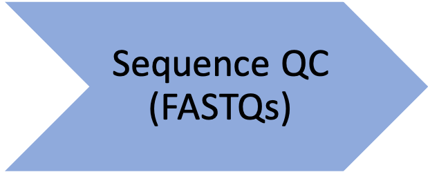
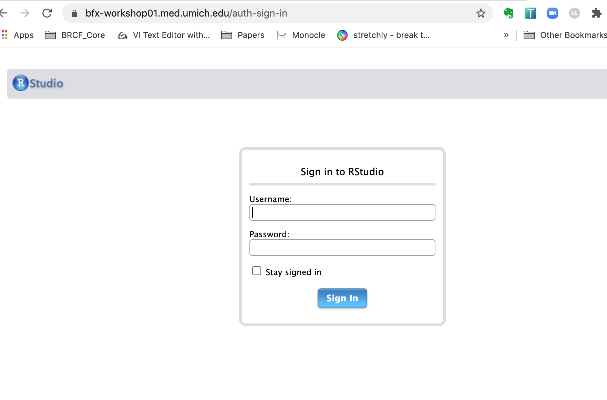

<style type="text/css">
body{ /* Normal  */
      font-size: 14pt;
  }
pre {
  font-size: 12pt
}
code.r{
  font-size: 12pt;
}
</style>

<!--- Allow the page to be wider --->
<style>
    body .main-container {
        max-width: 1200px;
    }
</style>


> # Objectives:    
> * Overview of reproducible research & analysis setup
> * Broad introduction to DESeq2 & why it is widely used for differential expression comparisons
> * How to import and review gene count table


# Differential Expression Workflow

Today we will proceed through key steps in a differential expression analysis, starting from a count table that's similar to what you generated in the first half of the workshop and similar to the one of the outputs included in the [data that the Advanced Genomics Core delivers](https://brcf.medicine.umich.edu/cores/advanced-genomics/data-delivery/) for RNA-seq libraries.

{width=95%}

#### [Warm-Up]

To get started, let's get a sense of what approaches you already use to compare gene expression:    

* If you've run a qPCR assay and enjoyed all the pipetting, put up a green 'check'. If you've run a qPCR assay and needed some time away from the multichannels, put up a red 'x' from the reaction panel.    
* If cloning a gene reporter construct (ie: promoter + GFP), worked for you the first time, put up a green check. If you have a freezer box full of cloning attempts, put up a red 'x'.    
* If you are ready to learn about bioinformatic tools for comparing gene expression, put up a green check. If you have some questions that should be addressed before we get started, use the 'raise hand' reaction.    


# Tools for Differential Gene Expression analysis

As discussed during the webinar, a common application for bulk RNA-seq is to test for differential expression between conditions or treatments, using statistical approaches that are appropriate for biological data.

While there are several tools that can be used for differential expression comparisons, we will use [DESeq2](https://bioconductor.org/packages/release/bioc/html/DESeq2.html) in our analysis today.

DESeq2 is one of two tools, along with [EdgeR](https://bioconductor.org/packages/release/bioc/html/edgeR.html), considered ['best practice'](https://bmcbioinformatics.biomedcentral.com/articles/10.1186/1471-2105-14-91) for differential expression. Both tools apply similar methods that account for the distributions we expect to see for RNA-seq and are fairly stringent in calling differentially expressed genes, lowering the risk of investigating genes that were really false positives (e.g. don't really have different expression between treatment groups and therefore are not relevant to the biological process).

Additionally, `DESeq2` also has an
[excellent vignette](https://bioconductor.org/packages/release/bioc/vignettes/DESeq2/inst/doc/DESeq2.html) *click link to open*
from Love, Anders, and Huber, from which our workflow is partially adapted, and is a good resource when analyzing your own data
(see also: [Love, Anders, and Huber. _Genome Biology_. 2014.](https://doi.org/10.1186/s13059-014-0550-8)).


<details>
    <summary>*Click for additional resources regarding statistical testing and tool comparison for RNA-seq data*</summary>
    To learn more about statistical testing and what distributions best model the behavior of RNA-seq data, a good resource is this [EdX lecture by Rafael Irizarry](https://www.youtube.com/watch?v=HK7WKsL3c2w&feature=youtu.be) or this [lecture by Kasper Hansen](https://www.youtube.com/watch?v=C8RNvWu7pAw). Another helpful guide is this [Comparative Study for Differential Expression Analysis by Zhang et al.](https://journals.plos.org/plosone/article?id=10.1371/journal.pone.0103207) from 2014.
</details>


## DESeq2 assumptions and requirements

A key assumption of DESeq2 is that for most experiments *biological variance is much greater than technical variance* (especially if [best practices](https://www.txgen.tamu.edu/faq/rna-isolation-best-practices/) for [quality RNA isolation](https://www.biocompare.com/Bench-Tips/128790-Four-Tips-for-Perfecting-RNA-Isolation/) are followed, including DNase treatment!).


Since calculating variance is key to the statistical approach used for DESeq2, if we tried to compare two treatment groups with less than **two** replicates, we would get an error, as shown in [this blog post](https://support.bioconductor.org/p/89746/). Without replicates, there cant't be statistical significance (e.g. p-values), but *qualitative* approaches are an option, like looking at the top expressed genes after normalization.

### Replicates in RNA-seq experiments

A frequent question for RNA-seq projects is "How many replicates do I need?". As mentioned in the webinar, there is often more contributing to the observed gene expression in each sample than the experimental treatment or condition of interest.


The general goal of our analyses is to separate the “interesting” biological contributions from the “uninteresting” technical or other contributions that either cannot be or were not controlled in the experimental design. The more sources of variation, such as samples coming from heterogenous tissues or experiments with incomplete knockdowns, the more replicates (>3) are recommended.  


For a more in depth discussion of experimental design considerations, particularly for the number of replicates, please read [A Beginner’s Guide to Analysis of RNA Sequencing Data](https://www.ncbi.nlm.nih.gov/pmc/articles/PMC6096346/) and papers like this one by [Hart et al](https://www.ncbi.nlm.nih.gov/pmc/articles/PMC3842884/) that focus on estimating statistical power for RNA-seq experiments.

#### Sequencing depth recommendations


A related experimental design consideration is how much sequencing depth should be generated per sample. This figure shared by Illumina in their technical talks is helpful to understand the relative importance of sequencing depth versus number of replicates.


{width=75%}

Generally, for the human and mouse genomes, the recommendation is 30-40 million reads per sample for polyA library preps, we the expectation is that ~25,000 protein-coding genes would be measured. This recommendation is to capture both highly expressed (abundant) and more lowly expressed (rarer) transcripts. However, as the image above shows, sequencing depth has less of an impact than number of replicates in detecting differentially expressed genes (DEGs).

#### [Exercise]: Building a better understanding of differential expression analysis

1) Post a comment below regarding what key question/misconception regarding designing an RNA-seq experiment we were able to address **OR**   
1) Post a question that that was NOT addressed but that you hope we will address in the later modules **OR**    
1) Add a thumbs up to your favorite comment(s) to upvote it    

----


# Reproducible Research

Today we'll be exploring some RNA-seq data that is fairly representative of what we see in the core and start with input files similar to the count tables currently being delivered by the Advanced Sequencing Core.

## Logging into the RStudio server

First navigate to server address `bfx-workshop01.med.umich.edu`, using a web browser. You should see a sign-in prompt screen, similar to shown below

{width=50%}

Next, use your unique name and the same password used yesterday to log-in to the server from the command line. You should now see some familar RStudio panels in your web browser window.


{width=50%}


## Best practices for file organization

As discussed in the [Software Carpentry materials](https://umcarpentries.org/intro-curriculum-r/) and other forums, including a review by [Nobel, 2009](https://journals.plos.org/ploscompbiol/article?id=10.1371/journal.pcbi.1000424), file organization and data stewardship are an important parts of reproducible research.

To follow best practices for file organization for bioinformatics/computational projects, we will need to make sure there are separate locations for:

* Raw data
* Code
* Output files

Such as illustrated in this figure from the Noble review:

{width=75%}

To organize our files for our analysis today, we'll create a new folder in our home directory and name it `2021-11-15-umich-rnaseq-demystified`:
```{r SetupDirectories, echo=TRUE}
dir.create("~/2021-11-15-umich-rnaseq-demystified", showWarnings = FALSE)
```
Then we'll set this our working directory:
```{r SetWorkingDir, echo = TRUE}
setwd("~/2021-11-15-umich-rnaseq-demystified")
```

Before moving forward, let's double check that we're in the right place.
```{r CheckDirectories, eval=FALSE}
getwd()
```
**Checkpoint**: *Please use the red 'x' button in your zoom reaction panel if you are not in your own '2021-Nov-umich-rnaseq-demystified' directory after executing the `getwd()` commands and the green 'check' if you see a similar path as I do*


## Creating our code file

Next, we'll create a new code file, using the toolbar at the top of our window and clicking the icon that looks like white square with a small green plus symbol.

From the drop down menu, select the first option named 'R Script'.

A new window should pop up in your console. We'll then use the blue floppy disc icon save our 'Untitled1' file as "DE_Analysis.R".

This new "DE_Analysis.R" will serve as a record of the analysis steps we follow for the remainder of the workshop.

**Checkpoint**: *Please use the red 'x' button in your zoom reaction panel if you would like these steps repeated and the green 'check' if you were able to create and save a code file*


*Note: This code file along with the resources shared in this workshop can also serve as a starting point for working through differential expression analyses with other example datasets or your own count table data in the future.*

## Downloading our data

Next, we'll create a new folder within `2021-Nov-umich-rnaseq-demystified` called `data` to store our raw data by copying & pasting the following command.

```{r SetupDirs2, eval=FALSE, message=FALSE, warning=FALSE}
dir.create("data", showWarnings = FALSE)
```

**Checkpoint**: *Please use the green 'check' if you see 'data' within your '2021-Nov-umich-rnaseq-demystified' directory and use the red 'x' button in your zoom reaction panel if you'd like the steps repeated*

Next, we'll download the files we'll need for today by copying and pasting the following commands.
```{r DownloadData, eval = FALSE}

download.file("https://raw.githubusercontent.com/umich-brcf-bioinf/2021-11-15-umich-rnaseq-demystified/master/data/SampleInfo_trimmed.csv", "data/SampleInfo_trimmed.csv")

download.file("https://raw.githubusercontent.com/umich-brcf-bioinf/2021-11-15-umich-rnaseq-demystified/master/data/gene_expected_count_trimmed.txt", "data/gene_expected_count_trimmed.txt")
```

If we look within our 'data' folder, we should now see two files:


{width=50%}


**Checkpoint**: *Please use the red 'x' button button if you don't see the files after clicking on the "data" directory so I can repeat the steps. If you have successfully downloaded the data then used the green 'check' button.*

---


#### Code execution shortcut reminder

**Ctrl-Enter** is a standard shortcut in Rstudio to send the current line (or selected lines) to the console. If you see an `>`, then R has executed the command. If you see a `+`, this means that the command is not complete and R is waiting (usually for a `)`).


<details>
    <summary>*Click for review of R conventions for object names*</summary>
    R has some restrictions for naming objects:
    * Cannot start with numbers
    * Cannot include dashes
    * Cannot have spaces
    * Should not be identical to a named function
    * Dots & underscores will work but are better to avoid
</details>

## Check package installations

Several  packages have already been installed on the server, so we can load them into our R session now. To do that we'll use the `library` function to load the required packages.

```{r Modules, message=FALSE, warning= FALSE, eval=TRUE}
library(DESeq2)
library(ggplot2)
library(tidyr)
library(dplyr)
library(matrixStats)
library(ggrepel)
library(pheatmap)
library(RColorBrewer)
library(data.table)
```


*Note: We expect to see some red messages in your console while these packages are loading*

R/RStudio has great resources for getting help, including [code 'cheatsheets'](https://www.rstudio.com/wp-content/uploads/2016/10/r-cheat-sheet-3.pdf) and package vignettes, like for [tidyr](https://cran.r-project.org/web/packages/tidyr/vignettes/tidy-data.html).

We previously loaded several libraries into our R session, we can check the tools documentation out using the `?` operator.
```{r CheckDocumentaion}
?`DESeq2-package`
```

**Checkpoint**: *If you see the R documentation for `DESeq2` pop up in your 'help' panel on the right, please indicate with the green 'check' button. If not please use the red 'x' button.*


### Raw data as input

Another key assumption for DESeq2 is that the analysis will start with [un-normalized counts](http://bioconductor.org/packages/devel/bioc/vignettes/DESeq2/inst/doc/DESeq2.html#why-un-normalized-counts).

To begin our analysis, we'll read in the **raw** count data file, `gene_expected_count_trimmed.txt` which is similar to what would be generated in the alignment steps yesterday (and what you could receive from AGC). We'll discuss later a few normalizations that can be helpful for us to understand how much a gene is expressed within or between samples, but normalized data **should not** be used as an input for DESeq2.

```{r DataTable, eval=TRUE}
CountTable <- read.table("data/gene_expected_count_trimmed.txt", header = TRUE, row.names = 1)
head(CountTable, n=2) # look at the top of the table
```

Now that the file is read into R, note that we've created a data frame that includes 'gene ids' in ENSEMBL format as rownames and count data from twelve different samples.

#### [Exercise]: RSEM outputs versus DESeq2 input requirements

If we think back to the RSEM outputs, the 'expected_counts' table may include fractions due to how the alignment tool resolves reads that map to multiple locuses). Since DESeq2 requires whole numbers, if we try to use the RSEM ouputs directly, DESeq2 will give us an error.

First let's check the count table in a different way, to see if our table includes fractions.
```{r RSEMoutput}
tail(CountTable, n=2)
```

*[Question]: To resolve this discrepancy between the RSEM outputs and expected input for DESeq2, what could we do?*

To round down all the columns of our `CountTable` that include count data (all columns since we set the gene names to be our row names), we can use the `round`()` function.
```{r RoundRawCounts}
CountTable <- round(CountTable)
tail(CountTable, n=2) # now whole numbers
```

An important note is that there are several bonus content sections on the instruction pages, like the two below that we will not be covering in this workshop, but that may have useful context or be helpful when you review this material.

<details>
    <summary>*Click for alternative DESeq2 input options for RSEM outputs*</summary>
    The package `tximport` is another option[recommended the DESeq2  authors](https://support.bioconductor.org/p/90672/) to read in the RSEM expected_counts, as this  package allows for the average transcript length per gene to be used in the DE analysis and, as [described by the author](https://support.bioconductor.org/p/88763/), the `tximport-to-DESeqDataSet` constructor function round the non-integer data generated by RSEM to whole numbers.

</details>

<details>
    <summary>*Click for comparison of RNA-seq data and microarray data*</summary>
    With [higher sensitivity, greater flexiblity, and decreasing cost](https://www.illumina.com/science/technology/next-generation-sequencing/microarray-rna-seq-comparison.html), sequencing has largely replaced microarray assays for measuring gene expression. A key difference between the platforms is that microarrays measure intensities and are therefore *continous* data while the count data from sequencing is *discrete*. A more detailed comparison between microarrays and sequencing technologies/analysis is outlined in [the online materials for Penn State's STAT555 course](https://online.stat.psu.edu/stat555/node/30/)

</details>


After the count data is processed, we can move on to "unblinding" our data, as the sample names are unique identifiers generated by a sequencing center and not very informative as far what samples belong to which experimental conditions.

## Getting help

R/Rstudio has a strong community component so if you are getting an error or wondering how to make a command work or how to perform a specific task, there is likely already a solution out there. Remember that Google is your friend, although it can sometimes be a challenge to figure out *what to search for*. Key parts of a successful search:

* Package or command run
* `R` or `Bioconductor`
* The error message if there is one
* Version information

How to get session information to aid in a search:
```{r Session info, eval = FALSE, message = FALSE}
sessionInfo()
```


Highly recommend using resources like [Bioconductor Support](https://support.bioconductor.org/), [Biostars](https://www.biostars.org/), and [Stack Overflow](https://stackoverflow.com/questions/tagged/r), including threads on specific packages or common bioinformatic tasks.

I personally use one or more of these resources **every day**.

# Summary

In this section, we:

* Set up our compute environment
* Learned about DESeq2
* Loaded our raw count tables (input file 1)

Now that we have our count data processed, we can move on to "unblinding" our data, as the sample names are unique identifiers generated by a sequencing center and not very informative as far as our experimental conditions.


---

# Sources
## Training resources used to develop materials
* HBC DGE setup: https://hbctraining.github.io/DGE_workshop/lessons/01_DGE_setup_and_overview.html   
* HBC Count Normalization: https://hbctraining.github.io/DGE_workshop/lessons/02_DGE_count_normalization.html   
* DESeq2 standard vignette: http://bioconductor.org/packages/devel/bioc/vignettes/DESeq2/inst/doc/DESeq2.html   
* DESeq2 beginners vignette: https://bioc.ism.ac.jp/packages/2.14/bioc/vignettes/DESeq2/inst/doc/beginner.pdf   
* Bioconductor RNA-seq Workflows: https://www.bioconductor.org/help/course-materials/2015/LearnBioconductorFeb2015/B02.1_RNASeq.html   
* CCDL Gastric cancer training materials: https://alexslemonade.github.io/training-modules/RNA-seq/03-gastric_cancer_exploratory.nb.html
* CCDL Neuroblastoma training materials: https://alexslemonade.github.io/training-modules/RNA-seq/05-nb_cell_line_DESeq2.nb.html


```{r WriteOut.RData, eval=TRUE, echo=FALSE, message=FALSE}
#Hidden code block to write out data for knitting

dir.create("rdata", showWarnings=FALSE)
save.image(file = "rdata/RunningData.RData")
#How to load for next segment
#load("rdata/RunningData.RData")
```

---

These materials have been adapted and extended from materials listed above. These are open access materials distributed under the terms of the [Creative Commons Attribution license (CC BY 4.0)](http://creativecommons.org/licenses/by/4.0/), which permits unrestricted use, distribution, and reproduction in any medium, provided the original author and source are credited.
