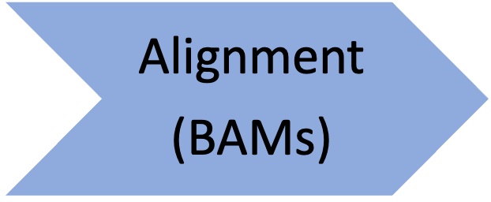
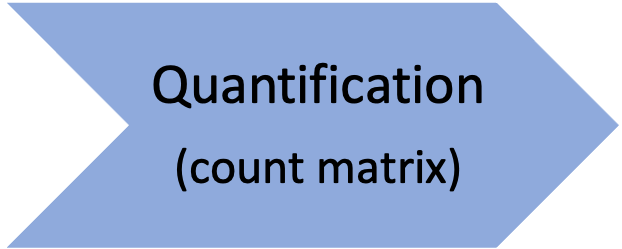
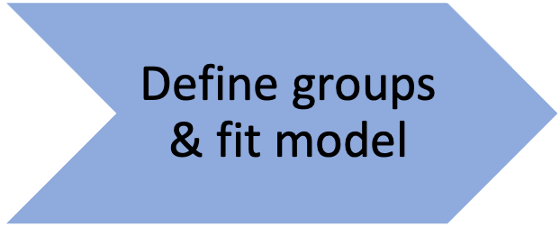
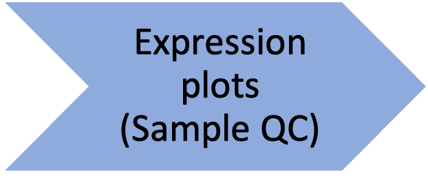
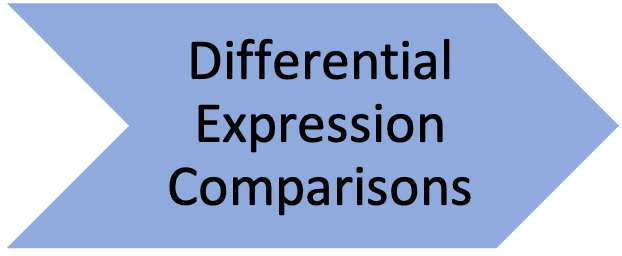

# RNA-seq Demystified

## [Setup instructions](setup_instructions)

## [Slack workspace](https://umcoderspaces.slack.com)

## Schedule

| Time | Topic | Details |
| ---- | ----------------- | ---------- |
| **Day 1 : Travis (& Chris)** |
| 9:00 | [Workshop Introduction](html/Module00_Introduction.html)
| 9:20 | [Warming Up](html/Module01_Warming_Up.html)
|<td rowspan="2"></td>|[Quality Control](html/Module02_QC.html) |
|  | [Optional - Trimming and MultiQC](html/Module02optional_Cutadapt_MultiQC.html) |
| 10:30 | **Break** ||
| <td rowspan="2"></td> | [Reference Genomes](html/Module03_Reference_Genomes.html) |
|  | [Sequence Alignment and Gene Quantification with STAR/RSEM](html/Module04_Alignment.html) |
| <td rowspan="2"></td> | [MultiQC and Count Matrix](html/Module05_MultiQC_and_Count_Matrix.html) |
|  | [Optional - Additional Information](html/Module05optional_Additional_Details.html) |
| 1:00 | **Day  1 concludes** |
| **Day 2 : Dana (& Chris)**|
| 9:00 | Intro Day 2 |
| 9:10 | |
| <td rowspan="3"></td> | [Introduction to DESeq2](html/Module06_DEAnalysisSetup.html) |
|  | [DESeq2 Initialization](html/Module07_DESeq2Init.html) |
|  | [Count Normalizations and DESeq2 model fitting](html/Module08_DESeq2DE.html) |
| 10:30 | **Break** |
|  |  | [Sample Visualizations for QC](html/Module09_SampleQCViz.html) |
| <td rowspan="2"></td> | [DE Comparisons and Gene Annotations](html/Module10_DEComparisons.html) |
|  | [DE Visualizations and output files](html/Module11_DEVisualizations.html) |
|  | [Optional - Additional QC Visualizations](html/Module11X_BonusContent.html) |
| 12:45  | [Wrap-up](html/Module99_Wrap_up.html) |
