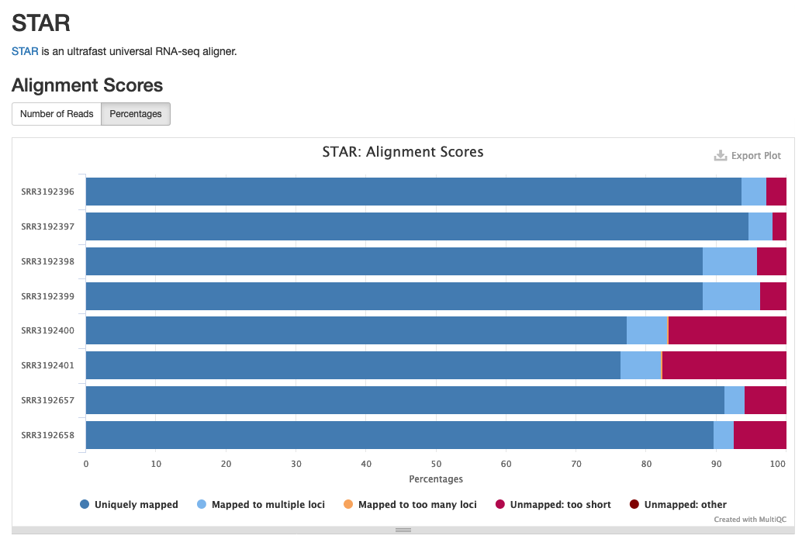

<style type="text/css">
body{ /* Normal  */
      font-size: 14pt;
  }
pre {
  font-size: 12pt
}
</style>

# MultiQC, Count Matrix

In this module, we will learn:

* about the MultiQC tool and its capabilities
* how to run multiQC on a remote system
* how MultiQC gathers information for QC purposes
* how MultiQC presents the results of cutadapt trimming and STAR alignment
* how to combine gene-level results into a count matrix

# Differential Expression Workflow

Here we will take the results from the previous module and operate on them a bit further. This will wrap up the preceding exercises, leaving us well-poised to begin differential expression, which we will discuss today and tomorrow.


<br>
<br>
<br>
<br>

## Alignment Statistics with MultiQC

After aligning reads it is often helpful to know how many reads were uniquely aligned, mapped to multiple loci, or not mapped at all. The `sample_NLog.final.out` file which is output alongside the alignments in `sample_N.temp/` folder (we used the `--keep-intermediate-files` flag), reports this information:

```
                                 Started job on |	Oct 02 13:09:23
                             Started mapping on |	Oct 02 13:09:51
                                    Finished on |	Oct 02 13:12:47
       Mapping speed, Million of reads per hour |	238.82

                          Number of input reads |	11675504
                      Average input read length |	146
                                    UNIQUE READS:
                   Uniquely mapped reads number |	10609591
                        Uniquely mapped reads % |	90.87%
                          Average mapped length |	146.37
                       Number of splices: Total |	2755543
            Number of splices: Annotated (sjdb) |	2734730
                       Number of splices: GT/AG |	2739697
                       Number of splices: GC/AG |	13204
                       Number of splices: AT/AC |	1744
               Number of splices: Non-canonical |	898
                      Mismatch rate per base, % |	0.18%
                         Deletion rate per base |	0.01%
                        Deletion average length |	1.60
                        Insertion rate per base |	0.01%
                       Insertion average length |	1.29
                             MULTI-MAPPING READS:
        Number of reads mapped to multiple loci |	599915
             % of reads mapped to multiple loci |	5.14%
        Number of reads mapped to too many loci |	12786
             % of reads mapped to too many loci |	0.11%
                                  UNMAPPED READS:
  Number of reads unmapped: too many mismatches |	20381
       % of reads unmapped: too many mismatches |	0.17%
            Number of reads unmapped: too short |	389960
                 % of reads unmapped: too short |	3.34%
                Number of reads unmapped: other |	42871
                     % of reads unmapped: other |	0.37%
                                  CHIMERIC READS:
                       Number of chimeric reads |	0
                            % of chimeric reads |	0.00%
```

# MultiQC

While the information is incredibly useful, it can be tedious to look at the report for each sample separately, while keeping track of what trends emerge. It would be much easier to look at all the data compiled into a single report. [MultiQC](https://multiqc.info/) is a tool that does exactly this.

MultiQC is designed to interpret and aggregate reports from [various tools](https://multiqc.info/#supported-tools) and output a single report as an HTML document.

## MultiQC Details

MultiQC's main output is the report file in HTML format. This can be viewed in a web browser. Additionally, it creates a `data` directory with text files containing the data that MultiQC gathered during its execution - this same data is what is shown in the report.

Given an output directory out_multiqc, we should see something like the following:

    # directory of multiqc data files
    out_multiqc/multiqc_data/multiqc.log
    out_multiqc/multiqc_data/multiqc_data.json
    out_multiqc/multiqc_data/multiqc_general_stats.txt
    out_multiqc/multiqc_data/multiqc_rsem.txt
    out_multiqc/multiqc_data/multiqc_sources.txt
    # multiqc report
    out_multiqc/multiqc_report.html


In a moment we will run `multiqc`, and it will detect these reports from STAR and include them in the report.

If we then open the MultiQC report (HTML), the newly included STAR section will look something like the following:

<center>


Example of STAR alignment statistics in MultiQC.

Source: [MultiQC example report](https://multiqc.info/examples/rna-seq/multiqc_report.html#star)

</center>

## MultiQC With STAR Exercise:

1. Note the contents of our analysis directory, including the STAR contents
2. Construct a MultiQC command and execute it on this directory
3. View the MultiQC report

```
# Ensure that we're in our analysis directory, note the contents
cd ~/analysis
ls -l
# View MultiQC help page
multiqc --help
# Construct a MultiQC command and execute it
multiqc --outdir out_multiqc_rsem out_rsem/
# Verify that the output files are present
```

We just learned how to view all of our alignment results in one report with the help of MultiQC. MultiQC is also useful because it can utilize multiple separate modules to create summary figures of different steps in our pipeline.

What would happen if we pointed multiQC at our trimmed read directory? What about if we point it to the entire analysis directory?

## MultiQC Multiple Module Exercise (Breakout)

1. Construct and run a MultiQC command to view the trimmed read results
2. Construct and run a MultiQC command to view both the trimmed read and aligned read results
3. (Optional) - Use scp to transfer a report from the AWS machine to your personal computer

<details>
<summary>MultiQC with Different Modules</summary>

```
# A MultiQC command to analyze the trimmed read results
multiqc --outdir out_multiqc_cutadapt out_fastqc_trimmed/
# A multiQC command for both trimmed and aligned read summary statistics
multiqc --outdir out_multiqc_all  .
```

</details>

<details>
<summary>Optional exercise - Transfer a MultiQC report to personal computer</summary>

Make sure you're running scp on your **local** computer, requesting a file from the **remote** computer we were just using.

scp command format, with the address for AWS remote

```
# Usage: scp [source] [destination]
scp <username>@bfx-workshop01.med.umich.edu:~/example_data/out_multiqc_all/multiqc_report.html ~/rsd-workshop/multiqc_report_all.html
```

</details>


## Creating the count matrix

We have viewed some of the gene expression quantification results individually. It can be useful to combine these expression values into a count matrix. This is helpful when gathering expression-level QC metrics, as well as for input into a differential gene expression program such as DESeq2.

There are many ways to combine these results into a count matrix. For this workshop, we'll use a small python script to `combine.py` that we've made for this purpose. To understand the process a bit more, let's review the `.genes.results` files that we want to combine and discuss some details of the script. Finally, we'll end with an exercise creating a count matrix.


If we review the *.genes.results files, we can see various columns of data output from RSEM that we discussed in the last module.

    # Review of *.genes.results file contents
    gene_id                 transcript_id(s)                        length  effective_length        expected_count  TPM     FPKM
    ENSMUSG00000000001      ENSMUST00000000001                      3262.00 3116.28                 601.00          45.50   36.70
    ENSMUSG00000000003      ENSMUST00000000003,ENSMUST00000114041   799.50  653.78                  0.00            0.00    0.00

We'll take the `expected_count` column from each sample's data, and combine these so that we have an aggregated data matrix with a row for each gene and a column for each sample.

The input for this step will be the directory of *.genes.results files from RSEM, and the output will be a tab-separated count matrix file which we can use for count-level QC and differential expression analysis.


<details>
<summary>Contents of combine.py script</summary>

[Here](https://gist.github.com/twsaari/12c5aa2773292c09c1809d5a3db66903) are the contents of the python script we'll use, `combine.py`:
</details>

## Count Matrix Exercise:

1. View the help file of `combine.py`
2. Construct / execute a command to combine our results into a count matrix
3. View the resulting count matrix

```
# View the help file of combine.py
combine.py --help
# Construct and execute the command to combine.py
combine.py --input_path "out_rsem/*.genes.results" --output_file combined_counts.txt -c expected_count --id_columns gene_id
# View the resulting count matrix
less combined_counts.txt
```

---

These materials have been adapted and extended from materials created by the [Harvard Chan Bioinformatics Core (HBC)](http://bioinformatics.sph.harvard.edu/). These are open access materials distributed under the terms of the [Creative Commons Attribution license (CC BY 4.0)](http://creativecommons.org/licenses/by/4.0/), which permits unrestricted use, distribution, and reproduction in any medium, provided the original author and source are credited.
