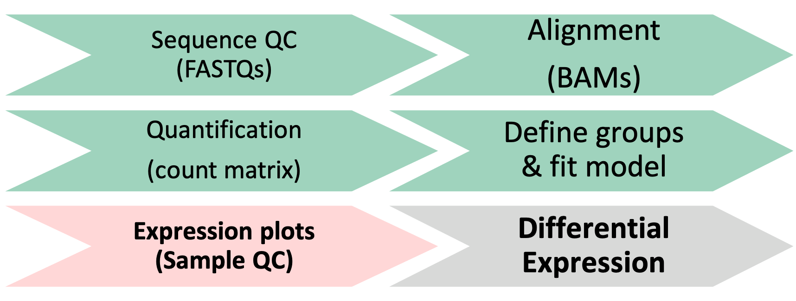
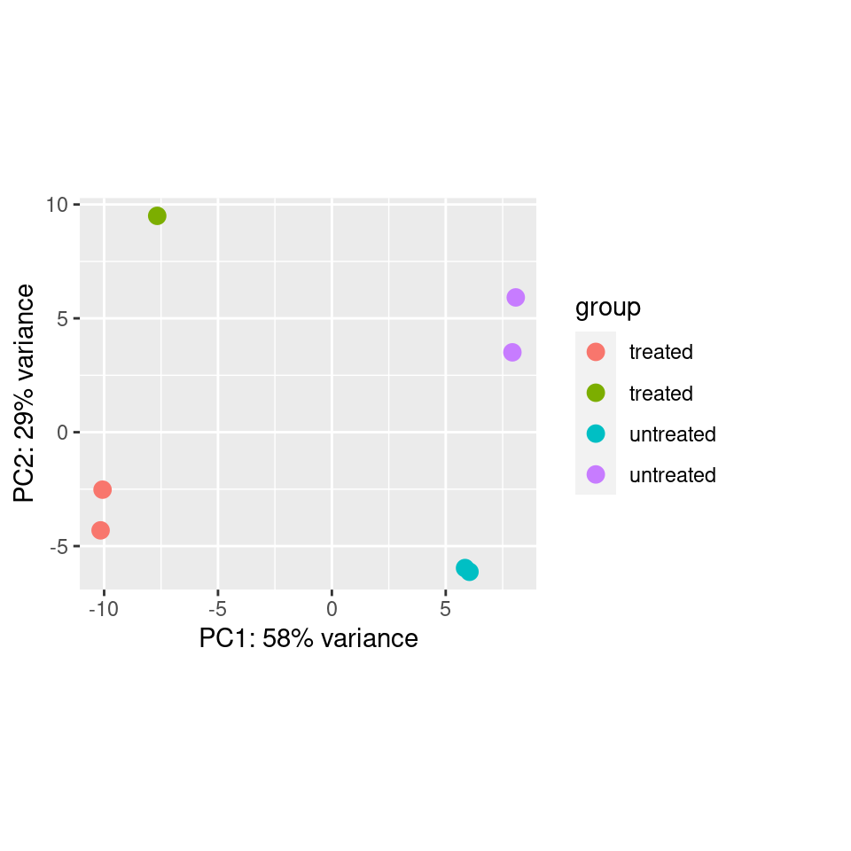

<style type="text/css">
body{ /* Normal  */
      font-size: 14pt;
  }
pre {
  font-size: 12pt
}
code.r{
  font-size: 12pt;
}
</style>

<!--- Allow the page to be wider --->
<style>
    body .main-container {
        max-width: 1200px;
    }
</style>

> # Objectives:     
> * Generate common QC visualizations   
> * Understand how to interpret QC visualizations    
> * Understand when to revise the model used in the DESeq2 initialization    
> * Understand the pitfalls of post-hoc analysis     
> * Describe the causes and implications of batch effect or other QC issues in an RNA-Seq experiment     


```{r Modules, eval=TRUE, echo=FALSE, message=FALSE, warning=FALSE}
library(DESeq2)
library(ggplot2)
library(tidyr)
library(dplyr)
library(matrixStats)
library(ggrepel)
library(pheatmap)
library(RColorBrewer)
load("rdata/RunningData.RData")
```


# Differential Expression Workflow

Prior to testing for differential expression between our comparisons of interest, we'll first generate plots that will assess how well our samples match up with our expectations (based on their treatment groups) and what we might expect to see from our differential expression comparisons.

{width=75%}

---

# Sample Visualizatons for Quality Control     

On Monday, we discussed aspects of quality control assessment at the sequencing data level. Today we will outline sample-level and gene-level quality control assessments to determine what we should expect for our downstream differential expression comparisons.

To do this, we will first assess the similarity of our samples by using principal component analysis (PCA). This will allow us to determine how well patterns in the data fits our expectations from the experiments design and possible sources of variation.

Other common visualizations that we generate for our analyses include expression heatmaps, sample correlation heatmaps, and boxplots of raw and/or normalized counts, the code for which can be found as bonus content through the materials for today and in the bonus content module.

Before we get started, we'll download one more file that we'll be using to work through some group exercises:

```{r DownloadRmd}
download.file("https://raw.githubusercontent.com/umich-brcf-bioinf/2021-11-15-umich-rnaseq-demystified/master/data/DESeq2_Exercises.Rmd", "./DESeq2_Exercises.Rmd")
```

## Principle Component Analysis (PCA) Plots

A common and very useful plot for evaluating how well our samples cluster by treatment groups are Principle Component Analysis (PCA) plots. PCA is used to emphasize variation and bring out patterns in large datasets by using dimensionality redution.

This image from
[a helpful step by step explaination of PCA](https://blog.bioturing.com/2018/06/14/principal-component-analysis-explained-simply/) helps to illustrate the principle component projections for two genes measured in approximately 60 mouse samples. Generally, this process is repeated and after each gene's contribution to a principle component or weight is determined, the expression and weight are summed across genes for each sample to calculate a value for each principle component.


>**Note**: A more detailed overview of the PCA procedure is outlined in [a Harvard Chan Bioinformatic Core training module](https://hbctraining.github.io/DGE_workshop/lessons/principal_component_analysis.html) and is based on a more thorough description presented in a [StatQuest’s video](https://www.youtube.com/watch?v=_UVHneBUBW0). Additionally, [this TowardsDataScience blog post](https://towardsdatascience.com/principal-component-analysis-3c39fbf5cb9d) goes through the math behind PCAs.

### Interpreting PCA plots


{width=75%}

In this plot, which is similar to what we'll generate below for our data, principle component 1 (PC1) explains ~80% of the variance in our data while principle component 2 (PC2) explains ~12% of the variance.

For most experiments, we expect the majority of the total variance to be explained by the first two or three principle components so this plot.

*[Question]: How might we interpret the variance explained by each principle component in the context of the labeled sample points?*


For more information, this [helpful overview of PCA basics](https://blog.bioturing.com/2018/06/14/principal-component-analysis-explained-simply/) walks through both the generation and interpretation of similar plots.    


### Evaluating batch effects or confounders

PCA plots are useful for evaluating the impact of factors other than the experimental treatment or group.

At times, batch effects can be quite obvious, such as this example from the [DESeq2 vignette](http://bioconductor.org/packages/devel/bioc/vignettes/DESeq2/inst/doc/DESeq2.html), where there is clear separation within the treatment groups.




If we color only by sequencing run type (paired-end vs. single-end), we see that PC2 (29% of variance) is primarily explained by this technical covariate.


However, the samples are clearly seperated by experimental condition on PC1, and since PC1 explains more variance than  PC2 **and** since we have non-confounded batches, we could incorporate the technical covariate into our model design, such as outlined in the [DESeq2 vignette](http://bioconductor.org/packages/devel/bioc/vignettes/DESeq2/inst/doc/DESeq2.html#multi-factor-designs).

<details>
    <summary>*Click for complex design discussion*</summary>
    In experiments with more complex designs, such as when there are interesecting/multiple treatment conditions, it can be less clear what covariants are influencing expression, such as illustrated from [this documenation for a microarray analysis tool](http://www.molmine.com/magma/global_analysis/batch_effect.html).
    From the PCA labeled by experimental treatment, we see that samples from the treatment group do not cluster together and that there is high variance across all treatment groups.
    
    However, when the plot is color coded by the technical batches of probe labeling, we see that the patterns in the data are better explained by batch than the experimental conditions.
    
</details>

#### When to remove samples or update the design formula

Generally, the decision to remove samples should not be taken lightly, especially if the consideration is based on the expression level vs more technical quality issues (like sequencing quality). Doing so without sufficient justification could potentially bias your results. Other training materials have a step-by-step example of evaluating [batch effects](https://hbctraining.github.io/DGE_workshop/lessons/03_DGE_QC_analysis.html) using PCAs, that we would recommend reviewing prior to removing any samples from your comparisons.


If your PCA reveals patterns that were not accounted for in the initial model fit, the [DESeq2 vignette](http://bioconductor.org/packages/devel/bioc/vignettes/DESeq2/inst/doc/DESeq2.html#multi-factor-designs) provides an overview of how to add additional covariates to a model design before refitting the DESeq2 model for a dataset.

## Plot Setup

We've already loaded the libraries we need for this module. We'll follow best practices and create new directories to organize our output figures, as well as a variable to store a descriptor of the dataset we are looking at so we can more easily recycle our plotting functions.

```{r Setupdirectory}
plotPath = 'figures/'
dir.create(plotPath, showWarnings = FALSE)
Comparison <- "Gtype.Tx" # descriptor for the dataset we are looking at
```

## PCA Plot initialization

Below, we will plot the rlog normalized data for our samples projected onto a 2D plane and spanned by their first two principle components to visualize the overall effect of experimental covariates and determine if there is evidence of batch effects.

We'll generate the PCA projections for the top 500 using the `plotPCA` function from DESeq2, specifying `Gtype.Tx` as the condition of interest, and view the simple plot generated by the function.

```{r PCArlog3}
p.all <- plotPCA(rld, intgroup = c('Gtype.Tx'), ntop = 500)
p.all
```

We also see that samples in both `control` groups are fairly tightly grouped, while samples within each `Tx` group do not cluster as tightly. There does not appear to be any clear evidence of batch effects.

Next, we'll save this plot to file.
```{r PCArlog1}
pdf(file = paste0(plotPath, 'PCAplot_rlog_', Comparison, '.pdf'), onefile = TRUE)
p.all
dev.off()
```

**Checkpoint**: *If generated and saved the `p.all` PCA plot, please indicate with the green 'check' button. Otherwise, please use  use the red 'x' button in your zoom reaction panel to have this step repeated.*

## [Breakout Exercise 1]: PCA plot customization with ggplot2

We can generate a customized plot using the `ggplot2` package that will include shape assignments for our treatment groups and color assignments for the individual samples.


First, create some objects to store the sample and group information.
```{r PCAexercise1}
#PCA plot for Rlog-Normalized counts for all samples
CombinatoricGroup <- factor(MetaInfo$Gtype.Tx)
SampleName <- factor(row.names(MetaInfo))
```
Take a look at `CombinatoricGroup` and `SampleName` - what information is now stored in these objects?

Next, look at the documentation for `plotPCA` function from DESeq2. Then write a command to store the PCA results for the top 500 genes for `intgroup` = 'Gtype.Tx', using the normalized data, as an object named `p.all`.

<details>
    <summary>*Click for solution*</summary>
```{r PCAexercise2}
#Generate the PCA projections using the `plotPCA` function from DESeq2.
p.all <- plotPCA(rld, intgroup = c('Gtype.Tx'), ntop = 500)
```
</details>

Next, look at the possible slots of the `p.all` object to determine where the PCA data is stored. Then, create a ggplot2 object called `gp`, specifying PC1 as the x-axis and PC2 as the y-axis and setting the color to correspond to the samples and the shape to correspond to the `CombinatoricGroup`. Add a primary title 'All samples Rlog-Normalized'

*Hint: Use aesthetics, e.g.: aes() and search for how to add a title to a ggplot figure*

<details>
    <summary>*Click for solution*</summary>
```{r PCAexercise3}
gp <- ggplot(p.all$data, aes(x = PC1, y = PC2, color = SampleName, shape = CombinatoricGroup)) +
geom_point() +
ggtitle(label = as.character('All samples Rlog-Normalized'))
```
</details>


### Additional plot asthetic options for PCA plot

If you have some extra time, explore the additional plot options that we usually include in our analysis (below), otherwise skip to outputting the plot.

<details>
    <summary>*Click for example of additional plot options*</summary>
    Work through the following plot options, testing out including and including the additional aesthetic commands, to understand how to make a complex but well labeled PCA plot.
``` {r PCAexerciseAdvanced}
gp <- ggplot(p.all$data, aes(x = PC1, y = PC2, color = SampleName, shape = CombinatoricGroup)) +
    scale_shape_manual(values=1:nlevels(CombinatoricGroup), name = 'Combinatoric Group') +
    geom_point(size=2) +
    ggtitle(label = as.character('All samples Rlog-Normalized')) +
    guides(colour=guide_legend(nrow = 12, title = 'Sample')) +
    xlab(p.all$labels[2]) + ylab(p.all$labels[1]) +
    theme_classic(base_size = 10)
```
</details>


Finally, to output the plot to file, use the `pdf()` function:
```{r PCAexerciseOutput}
pdf(file = paste0(plotPath, 'PCAplot_Fancy_rlog_', Comparison, '.pdf'), onefile = TRUE)
plot(gp)
dev.off()
```


## Transferring our plot to our local computer

To transfer our plot to our local computer, we need a few things:

1. The name of the file on the remote server
1. The path to the file on the remote server
1. Our login information
1. A tool on our local machine that will do the transfer for us
1. A destination for the file

First, let's remind ourselves of the value of `PlotPath` (which we used to output our file above)
```{r PathInfo, eval = FALSE }
# what's the remote path structure?
pwd()
# what's the subdirectory/file name?
paste0(plotPath, 'PCAplot_Fancy_rlog_', Comparison, '.pdf')
```

Since our working directory is `/2021-11-15-umich-rnaseq-demystified` and we saved the plot to the subdirectory `figures` the full file name and path information for the file we want to transfer is: `~/2021-11-15-umich-rnaseq-demystified/figures/PCAplot_Fancy_rlog_Gtype.Tx_ko.Tx_vs_wt.Tx.pdf`

Next, we need to open a terminal/console window on our **local** computer. 

Then, we should check that we have a program called `scp` by typing the program name on the command line and hitting `Enter`. We should see a usage statement for the program, which shows a number of options enclosed in `[` symbols, then `source ... target`.

Then, we can determine the full local path for where we want the file to be saved on our computer **OR** we can create and/or navigate to a folder before running the transfer in our local terminal/console window.

Next, we'll type scp and then specify our `source` and `destination` (as the `.` to indicate our current folder) in our local terminal/console window. *Note: you will need to substitute <USERNAME> for the username you were provided/used to log into the RStudio server*
```{r TransferExample, eval=FALSE}
scp <USERNAME>@bfx-workshop01.med.umich.edu:~/2021-11-15-umich-rnaseq-demystified/figures/PCAplot_Fancy_rlog_Gtype.Tx_ko.Tx_vs_wt.Tx.pdf .
```

We will be prompted for our password. After we enter it, we should see the download progress. If you look in the destination directory on your local machine (using your local file navigator), you should now see the file saved.

### Optional - Scree Plot example 

<details>
    <summary>*Bonus: Click for example code for generating a ScreePlot*</summary>
     A screeplot is a way to visualize the variance explained by all principle components.
     To generate a scree plot, the PCA results need to be used independently of plotting, such as described by [this statquest post](https://statquest.org/pca-clearly-explained/) and replicated below.
```{r ScreePlot}
# generate PCA loadings
pca <- prcomp(t(assay(rld)), scale=TRUE)

## get the scree information
pca.var <- pca$sdev^2
scree <- pca.var/sum(pca.var)
barplot((scree[1:10]*100), main="Scree Plot", xlab="Principal Component", ylab="Percent Variation")
```
    We can see that the majority (~65%) of the variance across our samples is explained by the first three principle components, giving us some additional confidence regarding the quality of our data.
    In these scree plot examples from BioTuring, the plot on the left fits what we would expect for a dataset with high signal from the experimental treatment, where the majority of the variance is explained by the first few principle components. The plot on the right illustrates a scenario where the variance is distributed across many components, which could be due to low signal from the experimental treatment, complex experimental design, or confounding factors.
image: 
</details>


#### Optional - PCA plot for raw data

It can sometimes be useful to also generate a PCA plot for the raw data as well as the normalized data, particularly

```{r PCAPlainRaw}
RC <- SummarizedExperiment(log2(counts(dds, normalized = FALSE)), colData=colData(dds))
p.raw <- plotPCA(DESeqTransform(RC), intgroup = c('Gtype.Tx'), ntop = 500)
p.raw
```

We see that there is less variance explained by PC2 and that the samples from the same group are not as well clustered for the raw data. Since this is prior to normalization, these differences are likely due to **technical** considerations like sequencing depth differences that are accounted for by the rlog normalization.  

<details>
    <summary>*Click for code for customized PCA plot of raw data*</summary>
```{r PCAraw}
pdf(file = paste0(plotPath, 'PCAplot_raw_', Comparison, '.pdf'), onefile = TRUE)
#PCA for Raw counts for all samples
RC <- SummarizedExperiment(log2(counts(dds, normalized = FALSE)), colData=colData(dds))
p.RC <- plotPCA(DESeqTransform(RC), intgroup = 'Gtype.Tx')

gpRC <- ggplot(p.RC$data, aes(x = PC1, y = PC2, color = SampleName, shape = CombinatoricGroup)) +     xlab(p.RC$labels[2]) + ylab(p.RC$labels[1]) + scale_shape_manual(values=1:nlevels(CombinatoricGroup), name = 'Combinatoric Group') + geom_point(size=2) + ggtitle(label = as.character('All samples Raw Data')) + theme(plot.title = element_text(hjust = 0.5)) + guides(colour=guide_legend(nrow=12, title = 'Sample'), legend.key = element_rect(size = 1), legend.key.size = unit(0, 'cm')) + theme_classic(base_size = 10) + theme(legend.margin=margin(t = 0, unit='mm'))
plot(gpRC)

dev.off()

# embedd example of plot (rlog only)
plot(gpRC)
```
</details>


# Summary

In this section, we:    

* Discussed variance within treatment groups     
* Discussed technical artifacts, including batches
* Learned to generate PCA plots


---


# Sources Used    
* HBC QC tutorial: https://hbctraining.github.io/DGE_workshop/lessons/03_DGE_QC_analysis.html    
* Detailed Heatmap tutorial from Galaxy: https://training.galaxyproject.org/training-material/topics/transcriptomics/tutorials/rna-seq-viz-with-heatmap2/tutorial.html   
* PCA Overview: https://blog.bioturing.com/2018/06/14/principal-component-analysis-explained-simply/     


```{r WriteOut.RData, eval=FALSE, echo=FALSE, message=FALSE, warning=FALSE}
#Hidden code block to write out data for knitting
save.image(file = "rdata/RunningData.RData")
```


---


These materials have been adapted and extended from materials listed above. These are open access materials distributed under the terms of the [Creative Commons Attribution license (CC BY 4.0)](http://creativecommons.org/licenses/by/4.0/), which permits unrestricted use, distribution, and reproduction in any medium, provided the original author and source are credited.
