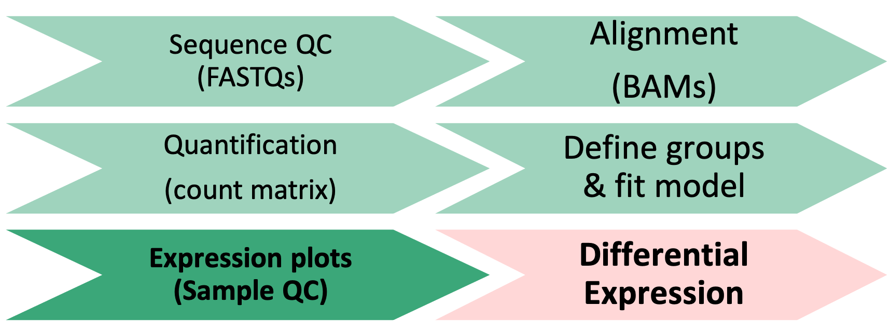

<style type="text/css">
body{ /* Normal  */
      font-size: 14pt;
  }
pre {
  font-size: 12pt
}
code.r{
  font-size: 12pt;
}
</style>

<!--- Allow the page to be wider --->
<style>
    body .main-container {
        max-width: 1200px;
    }
</style>

> # Objectives 
> * Generate tables of DE results
> * Understand what a p-value represents.   
> * Understand multiple hypothesis correction application and importance    


```{r Modules, eval=TRUE, echo=FALSE, message=FALSE, warning=FALSE}
library(DESeq2)
library(tidyr)
library(dplyr)
load("rdata/RunningData.RData")
```

# Differential Expression Workflow

Here we will finally test for differential expression between our comparisons of interest.

{width=75%}


---

# Generating DE results

*[Question]: Before we start, what do you think is the post challenging part of a differential expression analysis? (Post in thread below or raise zoom 'hand' to answer)*

Now that we have reviewed the plots by sample and determined that our data passed our quality control checks, specifically that the patterns we observe are likely due to our experimental treatments over technical or other confounding factors, we can focus on differential expression testing.

This illustration from the HCB training materials illustrates the basis of the differential expression procedure, where our goal is to compare the distribution of an expressed gene across samples in each treatment groups.

*Image credit: Paul Pavlidis, UBC*

Only where the distributions of each group are sufficiently separated will a gene be considered differentially expressed. 

This is where having sufficient replicates to overcome within group variance is important, as the more replicates we have in each group the better we can determine the distributions of expression for each group.

## DESeq2 statistical testing

We have already fit our DESeq2 model, specifing our model as `~ Gtype.Tx` and our next step is to identify genes with significantly different expression between our contrasts of interest. To determine significance, a statistical test is required.

The first step for any statistical test is to define the *null hypothesis*. In this case, the null hypothesis would be that there is no difference in the expression of a gene between two groups of samples, such as illustrated at the bottom of the first figure in this module. The next step is to use a statistical test to determine if, based on the observed data, the null hypothesis can be rejected.

To do this, [DESeq2 applies the Wald test](http://bioconductor.org/packages/devel/bioc/vignettes/DESeq2/inst/doc/DESeq2.html#theory-behind-deseq2) to compare two groups. A Wald test statistic is computed as well as the probability that the observed value or more extreme test statistic would be observed. This probability is called the p-value of the test. 

If the p-value is smaller than a pre-defined threshold, we would reject the null hypothesis and state that there is evidence against the null, i.e. the gene is differentially expressed. However, if the p-value is larger than our threshold, we would *fail to reject* the null hypothesis, meaning that we lack evidence that the expression of this gene is different *NOT* that we have evidence that the expression is indeed the same in both groups. 


For a more detailed overview of the statistical comparisons , please refer to [this HBC tutorial](https://hbctraining.github.io/DGE_workshop/lessons/05_DGE_DESeq2_analysis2.html) or the [DESeq2 vignette](http://bioconductor.org/packages/devel/bioc/vignettes/DESeq2/inst/doc/DESeq2.html#theory-behind-deseq2).


## Optional - Dispersion estimates

<details>
    <summary>*Click for code for customized PCA plot of raw data*</summary>
    We can visualize the **dispersion estimates** with the `plotDispEsts` function. This plot shows the the DESeq2 normalization results for our data, which centers on shrinking the variance across all genes to better fit the expected spread at a given expression level.
```{r CheckDispersions, eval=FALSE}
plotDispEsts(dds)
```
    If we ran the command above, we would see the raw data plotted in black, the fitted (or expected) dispersion in red, and the normalized data with scaled variance in blue. Since we have fairly small sample sizes for each condition, we see shrinkage for many genes but a reasonable correlation between the expression level and dispersions.
    This [HBC tutorial](https://hbctraining.github.io/DGE_workshop/lessons/04_DGE_DESeq2_analysis.html) has a more detailed overview of estimating size factors, estimating gene dispersion, and the shrinkage procedure, as well as examples of concerning dispersion plots that may suggest reassessing quality of the experimental data. 
</details>

## Results table output

In the results table we'll generate (similar to example shown below), the row name are gene symbols and there are six columns of values that are [described in more detail in an Illumina post](https://support.illumina.com/help/BS_App_RNASeq_DE_OLH_1000000071939/Content/Source/Informatics/Apps/DESeq2ResultFile_swBS.htm#:~:text=baseMean%E2%80%94The%20average%20of%20the,factors%2C%20taken%20over%20all%20samples.&text=log2FoldChange%E2%80%93The%20effect%20size%20estimate,the%20comparison%20and%20control%20groups). 


The first column, **'baseMean'** is the average of the normalized count values, divided by size factors and taken over all samples, and can be interpreted as the relative expression level of that gene across all samples. 

The second column, **'log2FoldChange'**, is the log2 transformed ratio of the expression of the numerator group (first group) over the denominator group (second group after "vs"). The third column, **'lfcSE'** is the standard error for the log2 fold change estimate. 

The fourth column, **'stat'**, is the calculated Wald statistic for that gene, while the fifth column 'pvalue' is the *nominal* significance for that gene.

### Multiple hypothesis testing and FDR correction

The sixth column, **'padj'**, is the *adjusted p-value* and is what we use for determining significantly differently expressed genes. 

*[Question]: Why do we use values from this column instead of the 'pvalue' column? (Post in thread below or raise zoom 'hand' to answer)*

Each p-value is the result of a single test for a single gene. The more genes we test, the greater chance we have of seeing a significant results. This is the multiple testing problem. 

If we used the p-value directly from the Wald test with a significance cut-off of p < 0.05, that means there is a 5% chance it is a false positives. So if we are testing 20,000 genes for differential expression, we would expect to see ~1,000 significant genes just by chance. This is problematic because we would need to sift through our “significant” genes to identify which ones are true positives.

DESeq2 reduces the number of genes that will be tested by removing genes with low number of counts and outlier samples (gene-level QC, see note below). However, we need to correct for [multiple hypothesis testing](https://multithreaded.stitchfix.com/blog/2015/10/15/multiple-hypothesis-testing/) to reduce the number of false positives, and while there are a few common approaches, the default method is False Discovery Rate(FDR)/Benjamini-Hochberg correction which is symbolized as 'BH' in DESeq2. [Benjamini and Hochberg (1995)](https://rss.onlinelibrary.wiley.com/doi/10.1111/j.2517-6161.1995.tb02031.x) defined the concept of FDR and created an algorithm to control it below a specified level. An interpretation of the BH method is implemented in DESeq2 in which genes are ranked by p-value, then each ranked p-value is multiplied by the number of total tests divided by rank.

**Note**: From the `results` function help page and [HBC tutorial that includes overview of multiple hypothesis correction](https://hbctraining.github.io/DGE_workshop/lessons/05_DGE_DESeq2_analysis2.html), we can change the multiple hypothesis correction method to an alternative option using the `pAdjustMethod =` argument.

The default FDR rate cutoff for DESeq2 is `alpha = 0.05`. By setting the cutoff to < 0.05, we expect that the proportion of false positives amongst our differentially expressed genes is now controlled to 5%. For example, if we call 500 genes as differentially expressed with this FDR cutoff, we expect only 25 of them to be false positives. DESeq2 vignette's includes a [further discussion of filtering and multiple testing](http://bioconductor.org/packages/devel/bioc/vignettes/DESeq2/inst/doc/DESeq2.html#independent-filtering-and-multiple-testing)

#### Note on 'padj' values set to NA

As discussed in the [HBC tutorial](https://hbctraining.github.io/DGE_workshop/lessons/05_DGE_DESeq2_analysis2.html) as well as the [DESeq2 vignette](http://bioconductor.org/packages/devel/bioc/vignettes/DESeq2/inst/doc/DESeq2.html#i-want-to-benchmark-deseq2-comparing-to-other-de-tools.)    

* If within a row, all samples have zero counts, the baseMean column will be zero, and the log2 fold change estimates, p-value and adjusted p-value will all be set to NA.    
* If a row contains a sample with an extreme count outlier then the p-value and adjusted p-value will be set to NA. These outlier counts are detected by Cook’s distance.     
* If a row is filtered by automatic independent filtering, for having a low mean normalized count, then only the adjusted p-value will be set to NA.   


## Generating results

We can check what comparisons were automatically generated during fitting using the `resultsNames()`. 
```{r Results1}
resultsNames(dds)
```

Since we are interested in comparing each knockout versus its corresponding wild-type control, one of the automatically generated comparisons is relevant. We can pull the `Tx_ko.Tx_vs_wt.Tx` comparison results using the `results` function and assign those result to a new object.
```{r SetsResult}
Comparison <- "Gtype.Tx_ko.Tx_vs_wt.Tx"
res_Tx <- results(dds, name=Comparison)
```

*[Question]: How would we look at our results?(Post in thread below or raise zoom 'hand' to answer)*

```{r ResultsKD}
head(res_Tx)
```

Note that in our comparison,the log2FoldChange column compares the expression of the numerator group (`ko.Tx`) over the denominator group (`wt.Tx`). If the value is positive, that means the expression of that gene is greater across the `ko.Tx` samples than across the `wt.Tx` samples. If the value is negative, that means the expression of that gene is greater across the `wt.Tx` samples. 

## How to generate additional contrasts

Since our dds object already has the fitted data, if there are comparisons that are not included in the `resultsName`, we can generate Wald test results by specifying those comparisons as an additional argument to the results function. 
```{r ResultsFunction}
?results
```

As the function description specifies, we need to provide a list of three elements: the name of the factor in the model design, the name of the numerator for the fold-change, and the name of denominator. 
```{r AdditionalComparisons}
res_WT <- results(dds, contrast=c("Gtype.Tx", "ko.control", "wt.control")) 
head(res_WT)
```


Now that we've generated our differential comparisons and have an understanding of our results, including multiple hypothesis correction, we can proceed with generating summary figures and tables for our differential expression analysis.

---

# Summary 

In this section, we:    

* Performed statistical tests for comparisons of interest     
* Generated tables of differential expression results - i.e. fold changes and adjusted pvalues for each gene in dataset      
* Discussed importance and application of multiple hypothesis correction      


Now that we've generated our differential comparisons and have an understanding of our results, including multiple hypothesis correction, we can proceed with generating summary figures and tables for our differential expression analysis.


---


# Sources Used
* HBC DGE training module, part 1: https://hbctraining.github.io/DGE_workshop/lessons/04_DGE_DESeq2_analysis.html
* HBC DGE training module, part 2: https://hbctraining.github.io/DGE_workshop/lessons/05_DGE_DESeq2_analysis2.html
* DESeq2 vignette: http://bioconductor.org/packages/devel/bioc/vignettes/DESeq2/inst/doc/DESeq2.html#differential-expression-analysis

---


```{r WriteOut.RData, eval=TRUE, echo=FALSE, message=FALSE, warning=FALSE}
#Hidden code block to write out data for knitting
save.image(file = "rdata/RunningData.RData")
```


---


These materials have been adapted and extended from materials listed above. These are open access materials distributed under the terms of the [Creative Commons Attribution license (CC BY 4.0)](http://creativecommons.org/licenses/by/4.0/), which permits unrestricted use, distribution, and reproduction in any medium, provided the original author and source are credited.
